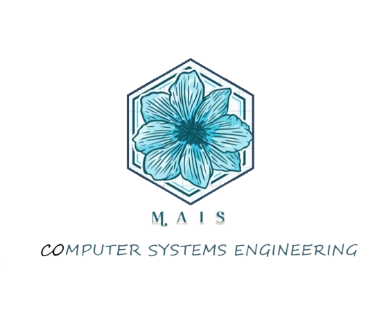

# Mais Sarhan  ⚛


# Overview 🚀

Welcome to my portfolio! This repository showcases my projects, skills, and experience in data science, AI, machine learning, and web development. It includes various projects that demonstrate my expertise in data analysis, predictive modeling, and software development.

# Directory Structure 📢
```
Portfolio/
├── projects/                               # Collection of projects
│   ├── projects.html/                      # Project html file
│   ├── projects.css/                       # Project css file
│   └── projects.js/                        # Project js file
├── static/                                 # resources
│   ├── css/                                # css
│   ├── js/                                 # js
│   └── photo/                              # Images, icons
├── resume/                                 # Resume and CV files
│   ├── resume.pdf                          
|   └── resume2025.pdf                      # Latest resume version
├── README.md                               # README file
└── index.html                              # index file information
```

# Projects ✅

## 1. AI-Based PPV Prediction 🇦🇮 🔥

- Description: Predicting PPV values using machine learning algorithms such as XGBoost, LightGBM, and CNN.
- Technologies Used: Python, Jupyter Notebooks, XGBoost, LightGBM, Pandas, NumPy

## 2. Hadoop MapReduce Sales Analysis 📝

- Description: A Hadoop MapReduce project analyzing sales data for a sports retailer.
- Technologies Used: Java, Hadoop, HDFS, MapReduce

## 3. Customer Shopping Trends Analysis JAVA Project 📊
- Description: Data mining project analyzing customer shopping trends based on demographic and seasonal factors.
- Technologies Used: Python, R, Pandas, Scikit-learn, Data Visualization

## 4. Sign up & log in Project  💥
- Description: Sign up & Login for User and Admain Project 
- Technologies Used: PHP language , HTML, CSS, JS and SQL Database

## to show more project check the portfolio 🔎

# Skills 🎯

- Programming Languages: Python, R, Java, PHP, SQL
- Machine Learning & AI: XGBoost, LightGBM, CNN, Scikit-learn
- Big Data Technologies: Hadoop, MapReduce
- Web Development: PHP, SQL, JavaScript, HTML, CSS
- Data Analysis & Visualization: Pandas, NumPy, Matplotlib, Seaborn

# Navigation 🧊
 
<div><a href="HTML/project1.html#frontj">Java</a></div>
<div><a href="HTML/project1.html#frontjs">JavaScript</a></div>
<div><a href="HTML/project1.html#frontPhp">PHP</a></div>
<div><a href="HTML/project1.html#frontAI">AI</a></div>
<div><a href="HTML/project1.html#frontNodej">Node JS</a></div>
<div><a href="HTML/project1.html#frontHtml">HTML & CSS</a></div>
<div><a href="HTML/project1.html#frontG">Graphics</a></div>


# Contact  🗪

- Email: maisserhan09@gmail.com
- LinkedIn: [Mais Sarhan](https://www.linkedin.com/in/mais-anwer/)
- GitHub: [Mais Sarhan](https://github.com/MaisSerhan)

# License 💎

This portfolio is licensed under the MIT License.

